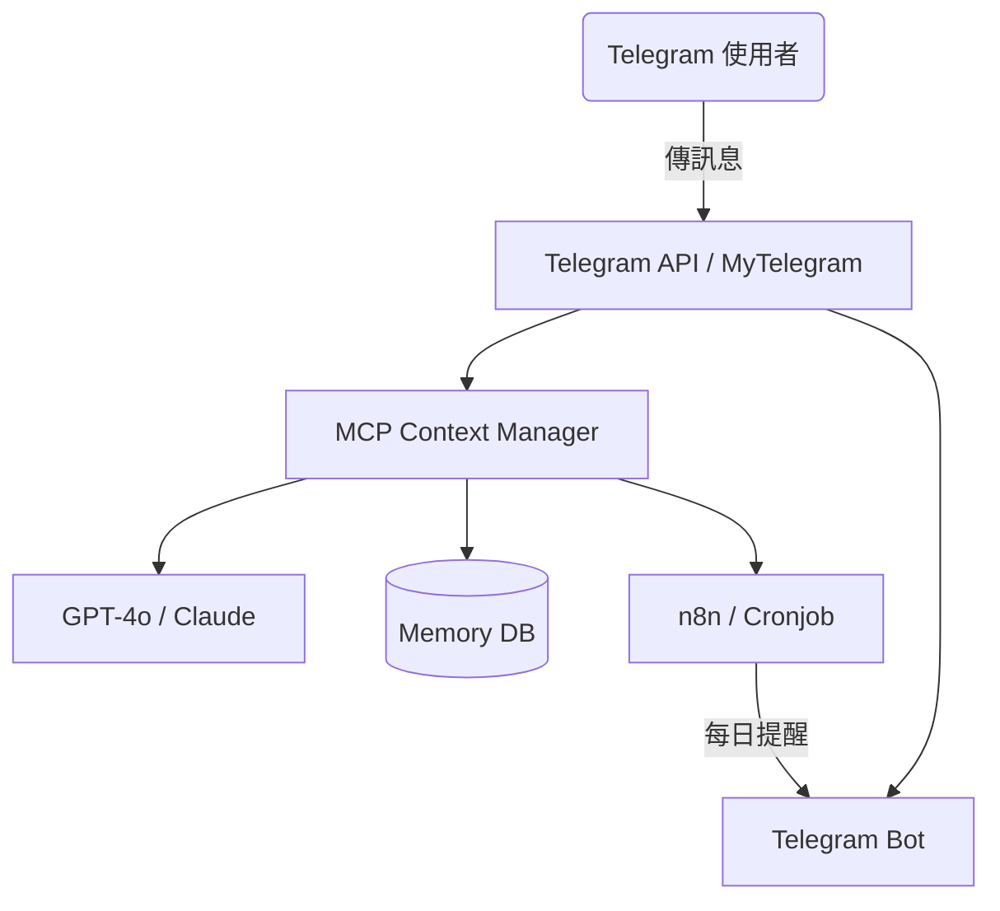

# AI Telegram 小助手 - 功能規格書

> 目標：打造一個具備 MCP（Model Context Protocol）能力的 AI 小助手，能從 Telegram 訊息中擷取待處理任務、管理上下文、提供每日摘要提醒。

---

## 📌 專案名稱

AI Telegram Assistant with MCP Support

---

## 🧠 專案核心概念：MCP (Model Context Protocol)

| 概念項目 | 說明 |
|----------|------|
| 用戶記憶 | 能記住任務上下文、處理狀態與訊息來源 |
| 任務意圖 | 自動辨識訊息是否包含待處理任務 |
| 狀態管理 | 追蹤任務進度（新、處理中、完成） |
| 任務摘要 | 定時推播每日/每週的代辦與提醒 |

---

## 🔧 系統架構概覽



---

## 🧩 功能模組清單

### 1. 訊息接收與分類模組

- [ ] 使用 `telethon`（或 Telegram Bot API）接收訊息
- [ ] 支援以下訊息來源，每個來源都可以設置過濾條件：
  - [x] 私人對話
  - [x] 群組
  - [ ] 頻道（可選）
- [ ] 檢測訊息是否符合以下條件：
  - 提及使用者（`@username`）
  - 包含任務語意（透過 LLM 分析）

---

### 2. 任務抽取與 MCP 上下文紀錄

- [ ] 使用 LLM 判斷訊息意圖
- [ ] 自動生成任務物件結構：

```ts
type Task = {
  id: string
  source: 'telegram'
  chatId: string
  messageId: string
  sender: string
  content: string
  detectedAt: string
  status: 'new' | 'processing' | 'done'
  tags: string[]
}
```

- [ ] 存入記憶資料庫（SQLite3）

---

### 3. 使用者記憶管理（MCP Memory）

- [ ] 儲存訊息上下文與任務歷程
- [ ] 支援持久性與過期策略
- [ ] 使用 Redis/Supabase/Postgres 儲存每位使用者的 context

---

### 4. 每日摘要提醒模組

- [ ] 每天固定時間（預設 09:00）主動通知使用者
- [ ] 提供今日尚未完成的事項摘要
- [ ] 提供快速操作建議（✅ 標記完成、🗑️ 忽略）

範例訊息：

```
👋 {使用者名稱}，你今天還有 3 件未處理事項：

1. 🔴 [群組A] @你：請幫我處理 XX 文件
2. 🟡 [私訊] 客戶問：今天有上線嗎？
3. 🔴 [群組B] TODO：整理上週的報表

🟢 要我幫你回覆第 1 點嗎？
```

---

## 🚀 技術棧建議

| 類別 | 工具 |
|------|------|
| 語意分析 | Gemini |
| Telegram 客戶端 | `telethon`（Python） |
| 任務排程 | `n8n` / `cron` |
| 記憶體儲存 | SQLite3 |

---

## ✅ 開發階段（MVP）

### 最小可行版本功能：

- [ ] 接收 Telegram 訊息並儲存
- [ ] 使用 LLM 判斷是否為任務
- [ ] 將任務記錄到 DB
- [ ] 每日產生提醒清單並傳回 Telegram

---

## 📁 專案結構建議

```
/src
  /bot              # Telegram Bot 入口
  /ingest           # 訊息接收與分類
  /llm              # 語意分析與任務提取
  /context          # MCP 記憶管理模組
  /scheduler        # 摘要與定時任務
/scripts
/docs
README.md
```

---

## 📎 附註與後續延伸

- 可加入「情境回憶機制」：讓 AI 記得一件事的上下文（例如對話、後續追問）
- 可增加「追問機制」：讓 AI 幫你自動回訊息（需要權限與 prompt 嚴格設計）
- 可整合 Google Calendar 作為任務提醒管道
